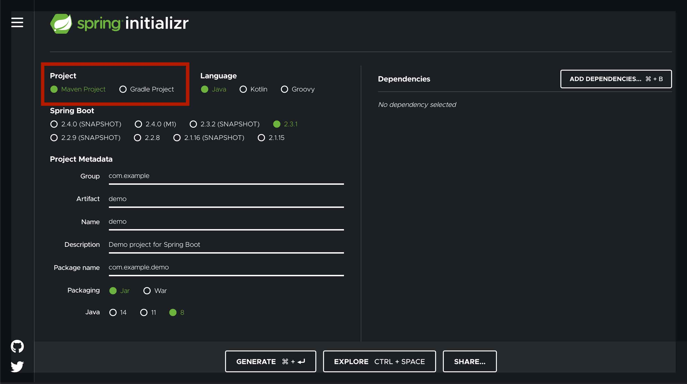
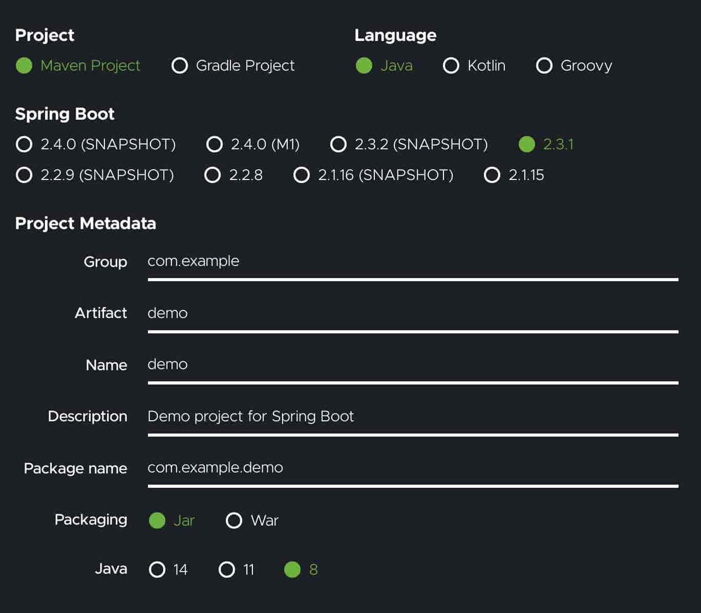

# Revisão de Conceitos

## Spring Boot

O Spring Boot tem sido cada dia mais usado no desenvolvimento de aplicações baseadas em Java por ser uma estrutura relativamente leve que simplifica a configuração de aplicativos baseados em Spring. 

## O que é Spring Initializr?

Spring initializr é um site que pode ser usado para configurar um projeto Spring Boot de maneira rápida e fácil.

## Configurar projeto Spring Boot

1 - Acesse o site do Spring Initializr `https://start.spring.io/`.

2 - Selecione a ferramenta de construção que deseja usar. Maven é selecionado por padrão.

3 - Em seguida, configure: 
- a linguagem de programação desejada (Java é a padrão)
- a versão do Spring Boot que deseja usar (versão mais recente é a padrão)
- os metadados do projeto (group, artifact, name, description, package)
- o empacotamento do projeto: jar ou war
- versão específica do Java, se desejar (Java 8, por padrão)

4 - Clique no botão `Add dependencies` e uma lista pop-up aparecerá para pesquisar as dependências que desejar.

5 - Clique no botão `Generate` para baixar o arquivo zip. 

