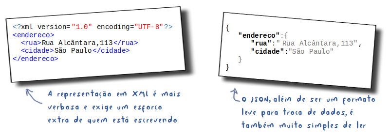
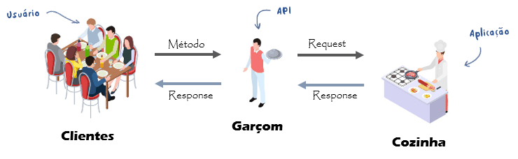
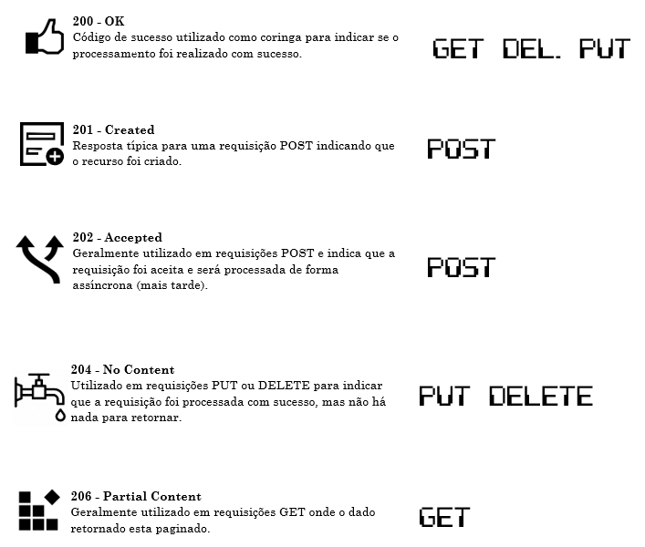

# API - Application Programming Interface

### Entenda o que é uma API!

Você pode até não saber o que é API, mas elas certamente já fazem parte de sua rotina: efetuar um pagamento online, reservar um hotel para as férias, usar o Google Maps para descobrir como chegar a um endereço, são apenas alguns exemplos de atividades comuns de nosso dia-a-dia e que funcionam por meio de APIs.

### O que é API?

API é a sigla utilizada para Application Programming Interface ou, em português, Interface de Programação de Aplicações. Através das APIs, os aplicativos podem se comunicar uns com os outros sem conhecimento ou intervenção dos usuários.

> Servem para integrar sistemas independente da linguagem de programação, proporcionando uma troca de informações de forma muito segura.

### Como API funciona?

Em um app que utiliza GPS, por exemplo, não programamos linhas de código para conectar-se a um satélite para obter as coordenadas do local onde o usuário se encontra. O Google já possui tudo isso desenvolvido e, assim, a 99 Táxi, Uber, Cabify, Correios e etc podem, simplesmente, chamar a API do Google Maps.

Outro exemplo é um site que utiliza informações do Facebook/Gmail para cadastrar novos usuários: através das APIs, o site envia uma requisição solicitando as informações necessárias para que esse novo usuário possa criar uma conta, utilizando tudo o que precisa e que já está presente nos servidores do Facebook/Gmail.

> Qualquer dispositivo (celular, PC, Carro, Totem, Site, Aplicativo) com conectividade com a Internet pode usar uma API, independentemente do sistema operacional ou da linguagem de programação.

### Porque usar APIs?

Em um mundo onde as pessoas podem acessar as informações oferecidas por um serviço a partir de tantos tipos de hardware e software diferentes, é essencial que cada empresa saiba como se aproveitar disso para explorar novos nichos de mercado.

A interface dos novos hardwares interconectados, wearables e, em breve, os carros sem motorista mostram como as APIs se tornaram importantes em nossas vidas.

### Representações

Vimos que uma API permite a interoperabilidade entre usuários e aplicações. Com isso, é muito importante pensarmos em algo padronizado e, de preferência, de fácil representação e compreensão por humanos e máquinas. Qual dos exemplos abaixo você escolheria para informar o endereço em uma carta?

> Derivado do JavaScript, JSON é um acrônimo de **JavaScript Object Notation**.

### A evolução de sistema

Antigamente, as aplicações Java eram grandes e pesadas, conversavam com banco de dados e até mainframe, faziam transações distribuídas e tornavam qualquer plataforma confiável para execução. Porém, muitas vezes surgiam o velho e conhecido problema de reaproveitamento de código: depois de vários sistemas feitos por diferentes equipes, descobria-se que todos eles tinham um mesmo cadastro de usuários. Que tal isolar essa parte em um sistema único?

#### SOAP (Service-Oriented Architecture)

Assim, na virada do século, surgiu o SOAP que fornecia serviços (internos e externos) usando o padrão de comunicação XML. Assim, os sistemas de diferentes linguagens e sistemas operacionais passaram a trocar informações, iniciando a era da arquitetura orientada a serviços - **Service-Oriented Architecture** (SOA).

#### Origem do REST

Uma alternativa bem simples ao SOAP foi proposta por Roy Thomas Fielding, um dos fundadores do projeto Apache HTTP, em sua tese de doutorado intitulada "Architectural Styles and the Design of Network-based Software Architectures": o famoso Representational State Transfer (REST). Essa simples alternativa ao SOAP aproveita os métodos existentes no protocolo HTTP para fazer as operações mais comuns existentes nos serviços, tais como: busca, inserção e atualização.

> Pela simplicidade e rapidez, o REST foi rapidamente adotado pelo mercado como o estilo arquitetônico.

#### Então, REST é...

REST define um conjunto de regras e boas práticas para o desenvolvimento de APIs que possibilitam a execução de solicitações e o recebimento de respostas via protocolo HTTP, como GET e POST, permitindo a comunicação entre aplicações.

#### E RESTful… qual a diferença?

Existe uma certa confusão quanto aos termos REST e RESTful. Entretanto, a diferença é apenas gramatical: sistemas que utilizam os princípios REST são chamados de RESTful.

### Como o REST funciona?

Toda a comunicação da interface REST é feita via web, ou seja, através de uma requisição (pedido feito pelo cliente) a uma URI (Uniform Resource Identifier), que referencia um recurso, utilizando um dos quatro métodos HTTP (GET, PUT, POST ou DELETE) que, por sua vez, traz uma resposta.

### Anatomia da Request

Nos exemplos acima, a requisição é composta de 4 partes:

### Anatomia da Response

Após o envio da requisição, o serviço deve interpretar a informação e retornar algo. A resposta é formada por:

### Design de API REST

Na hora de projetar uma API, tenhamos em mente o princípio de que ela deve sugerir sua própria utilização, isto é, deve ser auto-explicativa e o mais simples possível, para que os desenvolvedores raramente precisem ler a documentação. 

> É como se a API fosse um garçom: recebe os pedidos e retorna recursos (ou pratos) sem que os clientes precisem visitar a cozinha para ir pegar o prato lá.

### Códigos de resposta

O uso adequado dos códigos de retorno HTTP cobrem todos os casos comuns e todos os desenvolvedores entendem. É claro que não é necessário usar toda a coleção de códigos.

#### Sucesso

